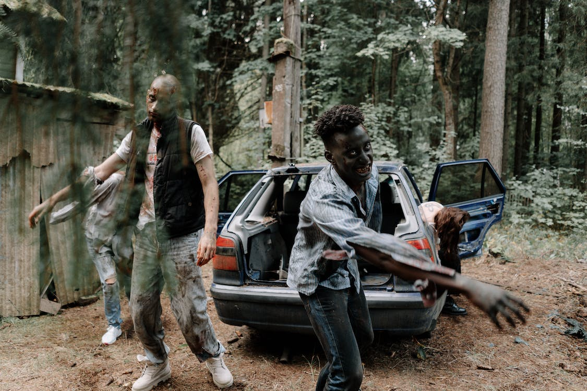

# ZOMBIE DICE

## O zumbi é você

Um apocalipse zumbi está acontecendo, mas esqueça daquele papo de sobrevivência, armas de fogo e correria. <strong>VOCÊ É O ZUMBI</strong>, e deve comer mais cérebros do que seus amigos para mostrar quem é que manda.

## Regras

Zumbis podem até ser feios, mas são honestos. Existem regras e elas são as seguintes:

<ul>
<li>Temos os seguintes dados: 6 dados verdes | 4 dados amarelos | 3 dados vermelhos.</li>
<ul><li>O dado VERDE tem 3 faces Cérebro (C), 2 faces Passo (P) e 1 face Tiro (T).</li>
<li>O dado AMARELO tem 2 faces Cérebro (C), 2 faces Passo (P) e 2 faces Tiro (T).</li>
<li>O dado VERMELHO tem 1 face Cérebro (C), 2 faces Passo (P) e 3 faces Tiro (T).</li></ul>
<li>A cada rodada, cada um dos jogadores jogará 3 dados escolhidos aleatoriamente.</li>
<li>Se caírem 3 faces T, o participante passa a vez e não soma ponto.</li>
<li>Cada face C é um ponto que, caso o jogador não tire 3 T em nenhuma jogada daquela rodada, será adicionado à sua pontuação total.</li>
<li>Cada face P é uma vítima que fugiu do jogador. Nem ajuda, nem atrapalha.</li>
<li>Depois de lançar os 3 dados, o jogador pode decidir se jogará novamente naquela rodada ou não. CUIDADO! Se você ficar com menos de 3 dados em uma rodada, o jogo vai quebrar e você acaba com a diversão de todo mundo.</li>
<li><strong>VENCE QUEM SOMAR 13 CÉREBROS PRIMEIRO.</strong></li>
</ul>

OBS: algumas regras foram adaptas para esta versão em Python

## Referências
<ul>
<li>Jogo: <a href="http://www.sjgames.com/dice/zombiedice/horde/">SJ Games.</a></li>
<li>Imagem usada neste readme: <a href="https://www.pexels.com/pt-br/foto/automovel-arrepiante-perigo-risco-5435454/">Pexels.</a></li>
</ul> 